# Siege Week 10 -> Blogick
A geometric physics and logic-based puzzle game!
[Theme was Anything]

<video src="https://github.com/user-attachments/assets/3d4a0e02-1ca9-483d-824f-3406016b51a6" width="320" height="240" controls></video>
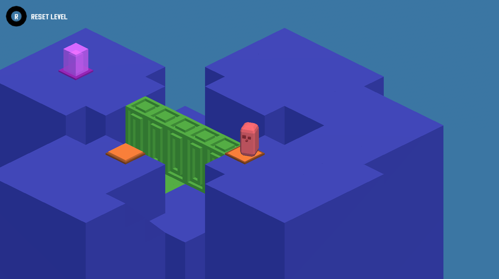

---
## Controls
- W/S to move forwards and backwards
- A/D to move left and right
- Play on web [here](https://baton-0.itch.io/blogick)!

## Overview
- Made with mostly inheritance;
- The puzzle elements work via a logic system of two parts;
    - Actors, that give out a bool, and
    - Reactors, that take in a logic statement made of ANDs, NOTs, ORs, and the values from Actors.
    - 

## Credits
- Music is [crazy space by rubberduck](https://opengameart.org/content/crazy-space).
- The footsteps are bits of [this by spenceomatic](https://freesound.org/people/spenceomatic/sounds/119766/)
- The font is [Cosmic Super Human Regular by hmeneses](https://www.1001fonts.com/cosmic-super-human-regular-font.html)
- The level complete SFX is [this by CogFireStudios](https://freesound.org/people/CogFireStudios/sounds/617764/)
- The pressure plate SFX is [this by mediatheksuche](https://freesound.org/people/mediatheksuche/sounds/623712/)
- The UI button SFX are randomly pitched clips of [this by BlondePande](https://freesound.org/people/BlondPanda/sounds/778444/)
- Otherwise, all the assets and code are created by me.

---
## Devlogs
### Monday -> Camera & Player
- Created the project, and got the orthographic camera and the player done.
    - The camera holds itself at the same offset from the player that it is from the origin on ready, so it was easy to change while testing.
    - 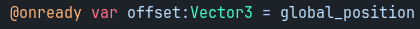
    - The player's  movement is rotated around the Y axis based on the position of the camera, so it makes sense to the user.
    - 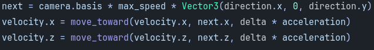
## Tuesday -> Puzzle System & Basic Environment
- Created Conditions, a node based system to allow the elements of the puzzle (ie the Walls and Goals) to have more complicated logic.
    - AND -> Only true if all subconditions are.
    - OR -> True if any subconditions are.
    - NOT -> The opposite of its subcondition.
    - STATIC -> Exports a bool for a solid value.
    - ACTOR -> The value given out by certain puzzle elements; Pressure Plates.
    - 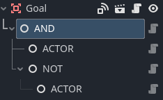
- Created Actors and Reactors
    - As the names imply, Actors give out a bool for conditions, and Reactors use that bool to do things, like a Pressure Plate lowering a Wall.
- Made 3D models for the floor and pillar tiles - though these got remodeled later.
## Wednesday -> Basic Elements, UI, & Levels
- Made some basic puzzle elements, though unmodeled.
    - Walls, a Reactor, that can be up or down.
    - 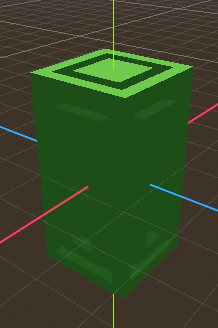
    - Pressure Plates, an Actor, that can also be up or down, and have (optionally) a timer, where they'll stay down for a period of time after being released.
    - 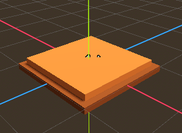
- Got the menu set up, and all animating correctly.
    - 3 Panes; Start, Options (which I ended up scrapping for time), and Levels.
- Got the Levels pane loading a button for every level, and made those buttons both load the levels and animate out of the menu.
## Thursday -> Game Loop, Modeling, & Crates
- Made a Goal Reactor, where touching it while it's powered wins the level.
- 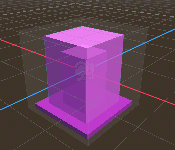
- Made a big Area3D below the levels, that resets the levels if you touch it to stop falling off the map.
- Remodeled the pillar pieces.
- 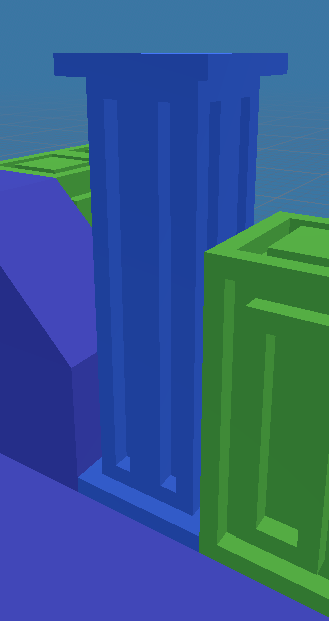
- Added Crates, pushable objects that can hold down the Pressure Plates. 
    - It took a LOT of fiddling to get the pushing working how I wanted; the player only has collision with the crate if it's touching a wall, so that otherwise it can be pushed without the player stuttering against it (there's definitely a better way)
    - 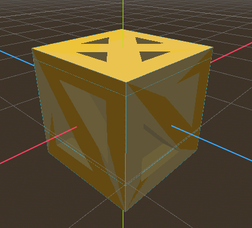
## Friday -> Reseting
- I was really busy, so all I got done was making it so that holding R resets the level; it just ties into the same chain of events as the death bounding box.
## Saturday -> GRIND Pt 1.
- Spent the entire day on the game.
- Made all the lighting flat, to fit the style I wanted.
- Made the player rotate smoothly instead of snapping (suprisingly tricky)
- 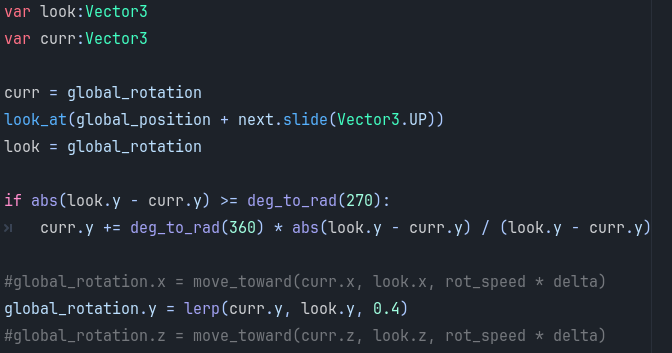
- Modeled the Goal, Pressure Plate, Player & Slopes.
- 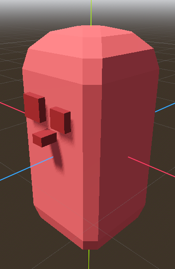
- Got all the textures for the UI and its buttons made and working.
- Made the first 2 levels.
- Added the music and got that working.
- Fixed SEVERAL bugs with the crates. Namely, if you turned while pushing one it would get launched, because the player's hitbox was sqaure, so it'd rotate and suddenly be inside the crate, throwing it.
## Sunday -> GRIND Pt 2.
- Again, spent the entire day on the game, even more than yesterday.
- Made 13 more levels.
- Added particles for the Pressure Plate and the Goal.
    - 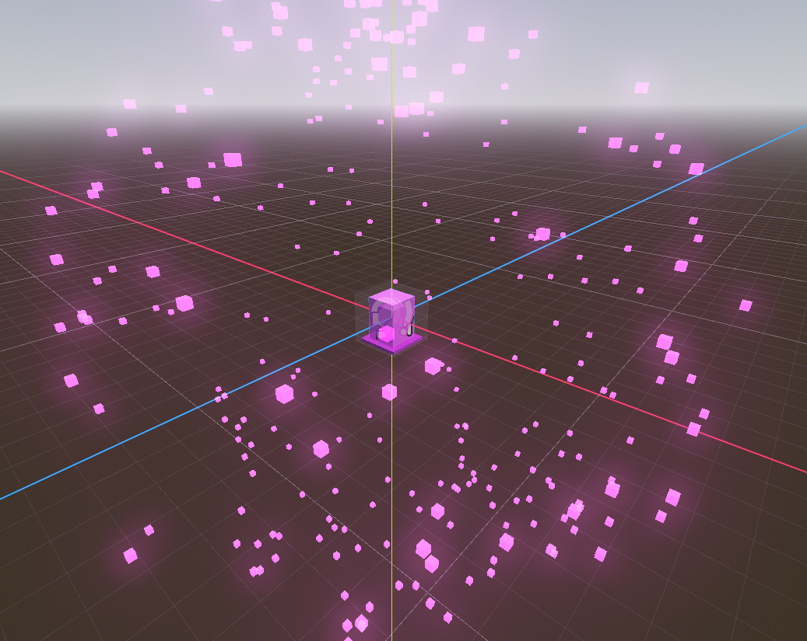
    - Tweaked the end animation so you can see the Goal particles for longer than an 8th of a second.
- Added ALL the sound effects.
    - Footsteps (about 5 samples, randomly pitched)
    - Pressure Plate clicking
    - UI Button clicking
    - Level Complete / Goal touching
- Updated the level reseting animation to be a multicolumn fade instead of just a flat rectangle.
- Tried fog, and gave up on it since it looked odd (and would probably have broken on web).
- Made the Levels locked unless you've done the previous one. Just a variable to store the highest available level and a "set the var to whichever's higher, what it is or this level + 1" when a level is beat.
- Scrapped the Options menu for time. All it would've had anyways were volume controls.
- Added a HUD for the reset function; first time finding out about circular progress bars!
- Made this README!